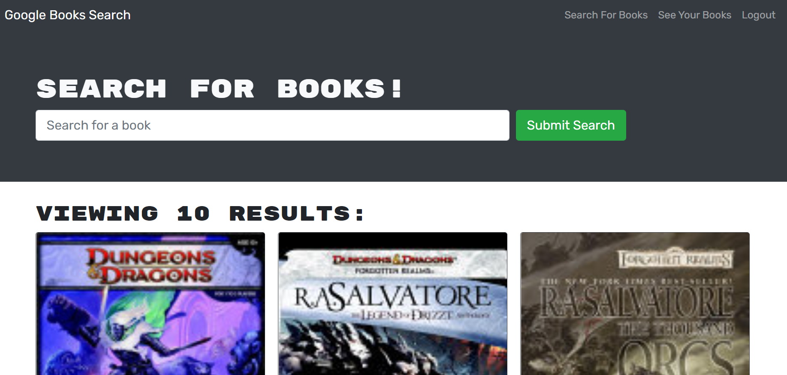

# Book-Search-Engine

## Deployment

[Book Search deployed site](https://kryptik-book-search.herokuapp.com/)

## Description

A book search application that looks up a book or novel by title or author.  A User can save a book to his personal profile so that the User can have a list of books to purchase or read in the future.

## Process

When a User opens the application, the User will be presented with a 'Google Book Search' and an input field to search for a book by title or author's name.  In the Nav menu both the "Google Book Search" and "Search For Books" text will route the User to the home page.  A User has a Login/Sign-up link as well, that saves the User's information.  The Login/Sign-up form displays with either a Login form or a Sign Up form.  The User can click on the Sign Up link and will be asked to input a username, email, and password.  Once the sign up criteria is met, the User will be logged in.  Any User can search for any book at anytime while on the application, but to save a book from the book search a User needs to be logged in so that those saved books can be saved to their personal account.  The User's password is encrypted using JSON Web Tokens (jwt.decode).  When the User searches for a book they are looking for, the book is displayed in a card with a cover photo, the title of the book, authors name, and a brief description of that book.  At the bottom of the book card there is a "Save this Book" link, when the User clicks that link that book is then saved to the User's personal account.  In the Nav menu after login of the User, two links are added "See Your Books" and "Logout".  When a User clicks on the see your books link, the User's profile page will render and display the books that User has chosen to save.  The books are displayed with the option to delete them from the User's profile when the User has no more use for them.  Lastly, A User can now logout of the application by clicking the logout link in the Nav menu or simply close the application out.

    

## Technology used

-  React.js
-  React- Boostrap
-  Netlify 
-  apollo/client
-  apollo-server-express
-  jwt-decode
-  graphql

## Contact Info

please contact me at [brandonjavillo@gmail.com](mail.google.com)

This project was bootstrapped with [Create React App](https://github.com/facebook/create- react- app).

